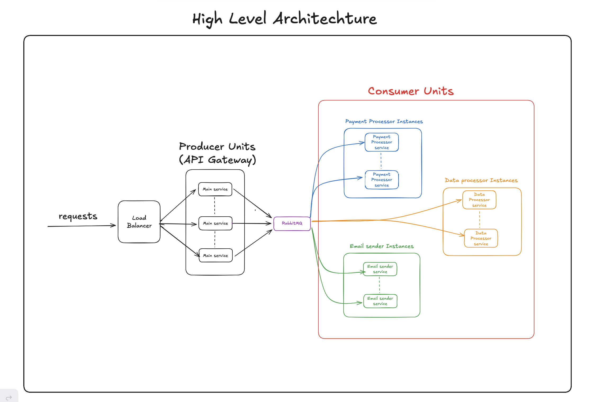
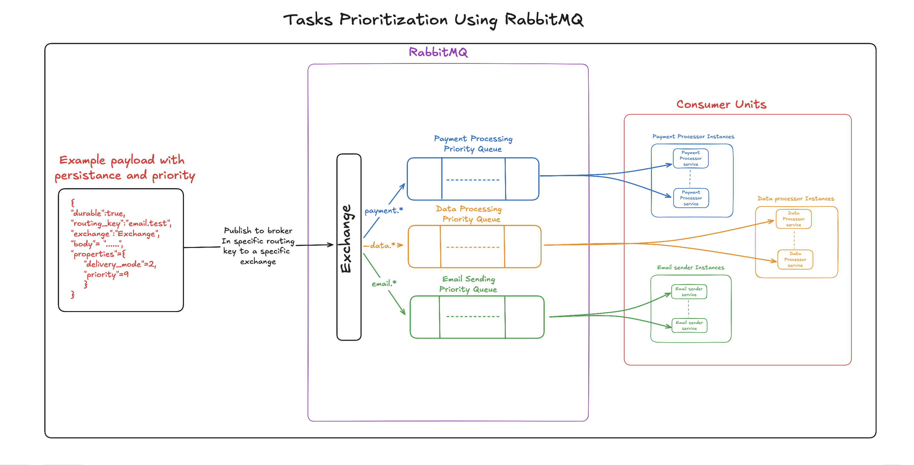
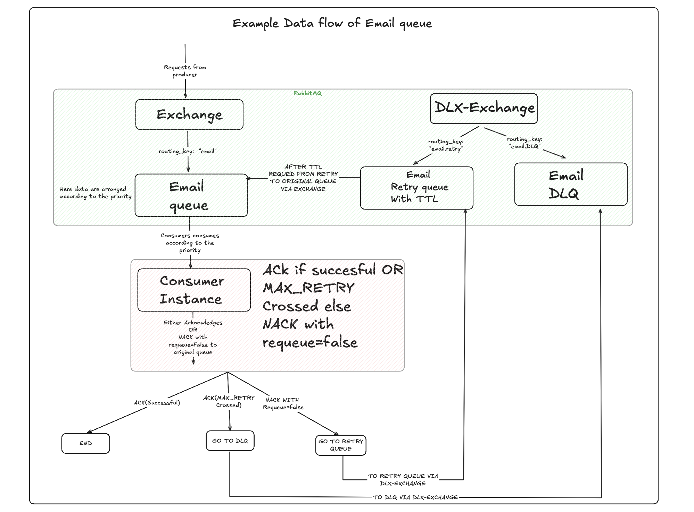

# High Level Architecture



## Priority RabbitMQ Architecture



## RabbitMQ Architecture With Dead Letter Exchange for retry and dead letter queues


## Example DataFlow with Dead Letter Exchange



> **Note**: If GitHub fails to render the diagrams above, you can view all architecture diagrams at: [Excalidraw Link](https://excalidraw.com/#json=dvqZwknQGYrJMvIMtxqEh,v51SHSdjPw7N-Q_gKc5shA)

## RabbitMQ Configuration for DataFlow Architecture

The routing behavior shown in the DataFlow diagram above is achieved through specific RabbitMQ configurations:

### Queue Configuration

```bash
# Email queue with DLX pointing to dlx-exchange for retries
rabbitmqadmin declare queue name=email.queue durable=true \
  arguments='{"x-dead-letter-exchange":"dlx-exchange","x-dead-letter-routing-key":"email.retry"}'

# Retry queue with TTL that routes back to normal exchange
rabbitmqadmin declare queue name=email.retry durable=true \
  arguments='{"x-message-ttl":30000,"x-dead-letter-exchange":"normal-exchange","x-dead-letter-routing-key":"email"}'

# Dead letter queue for permanently failed messages
rabbitmqadmin declare queue name=email.dlq durable=true
```

### Exchange and Binding Setup

```bash
# Create exchanges
rabbitmqadmin declare exchange name=exchange type=direct durable=true
rabbitmqadmin declare exchange name=dlx-exchange type=direct durable=true

# Bind queues to exchanges
rabbitmqadmin declare binding source=exchange destination=email.queue routing_key=email
rabbitmqadmin declare binding source=dlx-exchange destination=email.retry routing_key=email.retry
rabbitmqadmin declare binding source=dlx-exchange destination=email.dlq routing_key=email.dlq
```

### Key Configuration Parameters

| Parameter | Value | Purpose |
|-----------|-------|---------|
| `x-dead-letter-exchange` | "dlx-exchange" | Routes failed messages to DLX |
| `x-dead-letter-routing-key` | "email.retry" | Routes to retry queue by default |
| `x-message-ttl` | 30000ms | 30-second delay before retry |
| MAX_RETRIES | 3 | Consumer-level retry limit |

### Consumer Logic (Go)

```go
func processEmailMessage(ch *amqp.Channel, delivery amqp.Delivery) {
    const MAX_RETRIES = 3
    
    // Check retry count from x-death header
    failureCount := getEmailProcessingFailures(delivery.Headers)
    
    err := sendEmail(delivery.Body)
    
    if err != nil {
        if failureCount >= MAX_RETRIES {
            // Send to DLQ and ACK original
            sendEmailToDLQ(ch, delivery)
            delivery.Ack(false)
        } else {
            // NACK without requeue → triggers DLX routing
            delivery.Nack(false, false)
        }
    } else {
        delivery.Ack(false)
    }
}
```

This configuration ensures:
- **Failed messages** → DLX → Retry queue (30s delay) → Back to original queue
- **After max retries** → Consumer sends to DLQ and ACKs
- **Automatic retry counting** via RabbitMQ's x-death headers